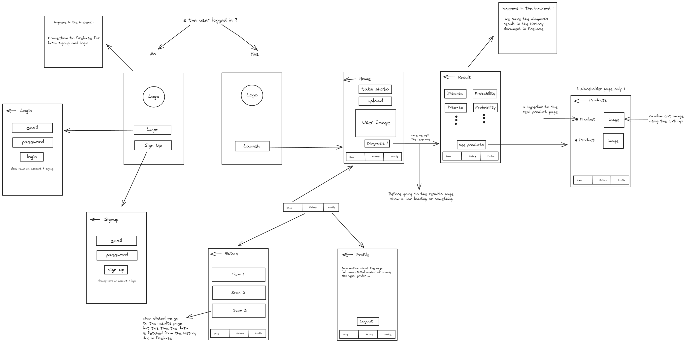

### Blossom, Dermatologist AI companion :

Blossom is a Mobile app made with react native and expo for the workflow, Firebase for the backend, uses Cloudinary for image hosting and Roboflow for AI Vision models hosting.

### Features :

- Two AI vision models, one for skin disease and one for skin type.
- Personalized chatbot for skin care which is aware of the scan history of the user and can provide advice based on it.
- A strong Recommendation system which uses local Moroccan products.

## App design :

### Detailed Features :

- The app login and signup is via google auth provided by Firebase.
- The skin type model is trained on approximately 5000 pictures while the skin disease model is trained on about 10000 picture.
- The chatbot is RAG based, and user context is stored in a vector database.
- The recommendation system uses products scraped and processed from various Moroccan websites for dermatology products, The raw scraped data is passed through a pipeline to an LLM ( we chose llama 3.1 70B ) which scores each product and  simplifies its composition and text description.

### The app is just a prototype, and not something made for production or even robust testing.