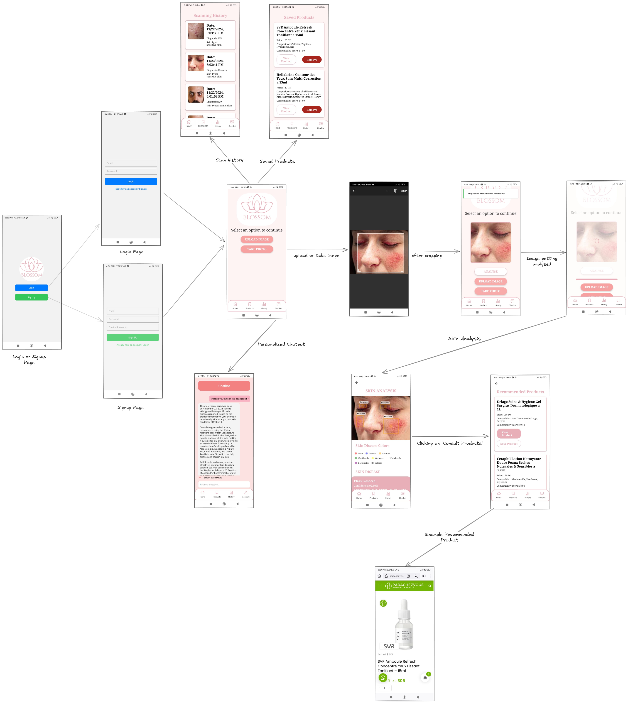

# blossom, Dermatologist AI companion

A react native app for Dermatology and skin disease diagnosis, uses :
- Firebase for saving users account and scan hostories
- cat API for simulating getting products recommendations
- JSONplaceholder for fake scan data generation and simulating a scan
- styled-components for styling and customizing the pages
- expo for the workflow

## App design : 

## TODO : 
- save scan history to a document in firebase ( for each client )
- design profile and history pages better
- look for a solution to the productts recommendations
- ....
